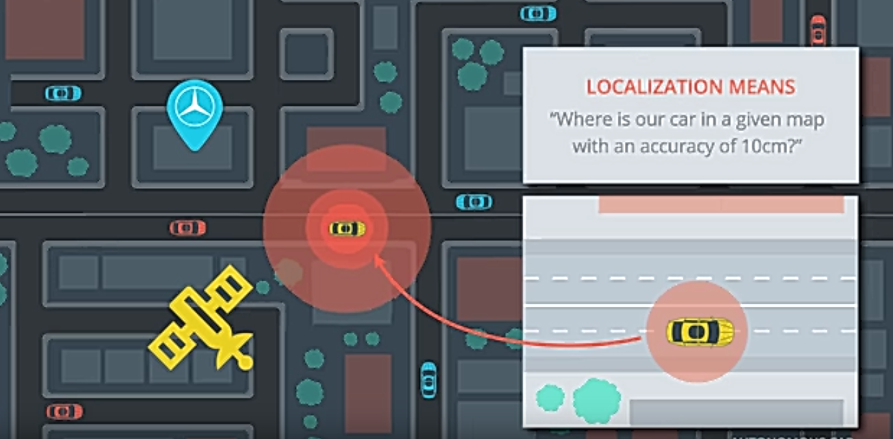

# Using Particle Filter for Accurate Vechile-Localization

# Overview
This repository contains all the code needed to implement the particle filter for the Localization of vehicles on the map.

## Project Introduction
A vehicle is being autonomously driven and needs to know accurately where it is on the map. The map of the vehicle location, a (noisy) GPS estimate of its initial location, and lots of (noisy) sensor and control data are available.

In this project I have implemented a 2 dimensional particle filter in C++. The particle filter is given a map and some initial localization information (analogous to what a GPS would provide). At each time step the filter will also get observation from the installed sensors (e.g. Lidar) on the the vehicle and control data from the vehicle gas/brake (velocity) pedals and the steering angle. 

## Running the Code
All code of the project is available [here](https://github.com/wafarag/Localization-using-Particle-Filter/tree/master/src)

This repository includes as well all the required [data](https://github.com/wafarag/Localization-using-Particle-Filter/tree/master/data) to run the code. 

